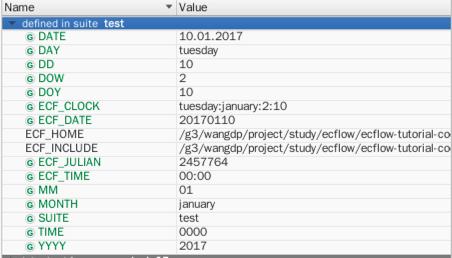

因为 ecFlow 是为 ECMWF 系统设计的，所以日期是一个重要的概念。

使用 [clock](https://software.ecmwf.int/wiki/display/ECFLOW/Glossary#term-clock) 定义 suite 的日期，
clock 是 suite 的属性，不同的 suite 可以有不同的时钟。

时钟有两种类型：

* [real clock](https://software.ecmwf.int/wiki/display/ECFLOW/Glossary#term-real-clock)：真实的机器时间，日期在零点或增加一天
* [hybrid clock](https://software.ecmwf.int/wiki/display/ECFLOW/Glossary#term-hybrid-clock)：日期和时间不相关，在 suite 完成前，日期固定，主要适用于超过24小时的 suite。时间与机器时间相同。

suite 的 clock 可以修改。这对那些运行在过去日期的 suite 十分有用（例如清除旧数据）

- `ECF_DATE`：生成变量，日期
- `ECF_TIME`：生成变量，时间
- `ECF_CLOCK`：生成变量，更详细的信息，例如星期


作业脚本中使用 suite 生成的日期和时间变量更安全，不推荐直接访问系统时间。

## 任务

1. 尝试修改 suite，使用 `ecflow_client --alter` 用上一周的某个 clock 日期运行 suite。

    ```
    ecflow_client --host=login05 --port=33083 --alter change clock_date 10.1.2017 /test
    ```

2. 查看 ecFlow 的变量。

    

## 注意：

* 如果使用 `repeat date` 类型结构，`date`、`day`和 `clock` 属性当前不可用。
* 带单个时间依赖的 `cron` 会自动重新提交。
* 修改时钟后，需要重新排队整个 suite。
