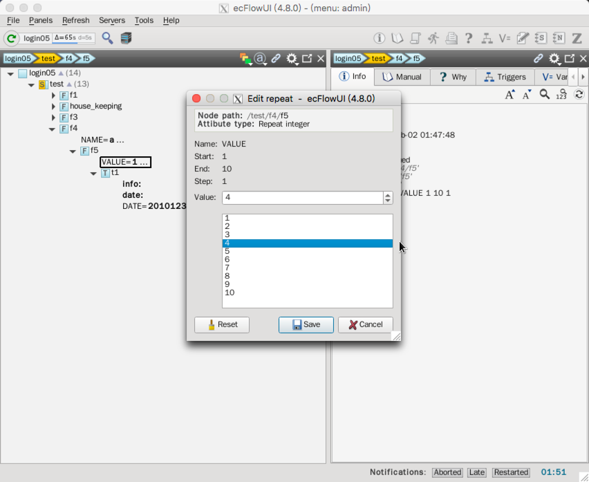
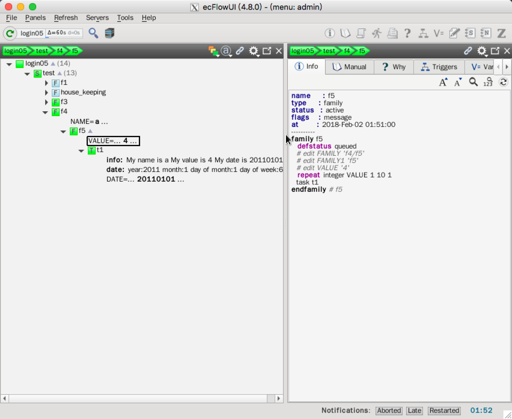

有时需要重复多次运行某些 `task` 或 `family`，按某指定值循环。
ecFlow 提供 [repeat](https://software.ecmwf.int/wiki/display/ECFLOW/Glossary#term-repeat) 属性实现该功能。

`repeat` 可以按下列类型的序列循环：

* 字符串
* 整数
* 日期

整数和日期的序列由起始元素、终止元素和可选的间隔（默认为1）生成。
ecFlow 会创建一个与 repeat 名字对应的变量，可以在脚本或 trigger 表达式中使用。

## Ecf脚本

创建一个新的脚本 `$ECF_HOME/test/f4/f5/t1.ecf`

```bash
%include <head.h>
ecflow_client --label=info "My name is %NAME%" "My value is %VALUE%" "My date is %DATE%"
# Note the use of repeat date generated variables DATE_YYYY, DATE_MM, DATE_DD, DATE_DOW to automatically reference year,month,day of the month,day of the week
# These can also be used in trigger expression.
ecflow_client --label=date "year:%DATE_YYYY% month:%DATE_MM% day of month:%DATE_DD% day of week:%DATE_DOW%" 
sleep %SLEEP%
%include <tail.h>
```

## Suite definition

在 suite definition 中添加 repeat，省略前面的定义。

### Text

`repeat` 定义语法：

```bash
repeat  ::=  "repeat" >> repeat_type >> +nextline
repeat_type  ::=  repeat_date | repeat_day | repeat_month | repeat_year | repeat_integer | repeat_enumerated | repeat_string
repeat_day  ::=  "day" >> unsigned integer >> !ymd
repeat_month  ::=  "month" >> unsigned integer >> !ymd
repeat_year  ::=  "year" >> unsigned integer >> !ymd
repeat_integer  ::=  "integer" >> identifier >> integer >> " " >> integer >> " " >> integer
repeat_enumerated  ::=  "enumerated" >> identifier >> +identifier
repeat_string  ::=  "string" >> identifier >> +identifier
repeat_date  ::=  "date" >> identifier >> ymd >> ymd >> integer
```

下面以整型和日期为例说明。

```bash
# Definition of the suite test.
suite test
 edit ECF_INCLUDE "$ECF_HOME"
 edit ECF_HOME    "$ECF_HOME"
 
 family f4
     edit SLEEP 2
     repeat string NAME a b c d e f
     family f5
         repeat integer VALUE 1 10
         task t1
             repeat date DATE 20101230 20110105
             label info ""
             label date ""
     endfamily
 endfamily
endsuite
```

### Python

```py
import os
from pathlib import Path
from ecflow import Defs, Suite, Task, Family, Edit, Trigger, \
    Event, Complete, Meter, Time, Day, Date, Cron, Label, \
    RepeatString, RepeatInteger, RepeatDate


# ... skip ...


def create_family_f4():
    return Family("f4",
                  Edit(SLEEP=2),
                  RepeatString("NAME", ["a", "b", "c", "d", "e", "f"]),
                  Family("f5",
                         RepeatInteger("VALUE", 1, 10),
                         Task("t1",
                              RepeatDate("DATE", 20101230, 20110105),
                              Label("info", ""),
                              Label("date", "")
                              )
                         )
                  )


print("Creating suite definition")
home = os.path.abspath(Path(Path(__file__).parent, "../../../build/course"))
defs = Defs(
    Suite('test',
          Edit(ECF_INCLUDE=home, ECF_HOME=home),
          create_family_f1(),
          create_family_house_keeping(),
          create_family_f3(),
          create_family_f4()))
print(defs)

print("Checking job creation: .ecf -> .job0")
print(defs.check_job_creation())

print("Saving definition to file 'test.def'")
defs.save_as_defs(str(Path(home, "test.def")))

# To restore the definition from file 'test.def' we can use:
# restored_defs = ecflow.Defs("test.def")
```

注意下面的对应关系

- 文本：`ecflow.RepeatString`
- 整数：`ecflow.RepeatInteger`
- 日期：`ecflow.RepeatDate`

运行脚本：

```
$python test.py
Creating suite definition
# 4.8.0
suite test
  edit ECF_INCLUDE '/g3/wangdp/project/study/ecflow/ecflow-tutorial-code/build/course'
  edit ECF_HOME '/g3/wangdp/project/study/ecflow/ecflow-tutorial-code/build/course'
  # ... skip ...
  family f4
    repeat string NAME "a" "b" "c" "d" "e" "f"
    edit SLEEP '2'
    family f5
      repeat integer VALUE 1 10
      task t1
        repeat date DATE 20101230 20110105 1
        label info ""
        label date ""
    endfamily
  endfamily
endsuite

Checking job creation: .ecf -> .job0

Saving definition to file 'test.def'
```

#### Python API 说明

##### ecflow.RepeatDate 日期

```bash
RepeatDate(variable,start,end,delta)
   string variable:     The name of the repeat. The current date can referenced in
                        in trigger expressions using the variable name
   int start:           Start date, must have format: yyyymmdd
   int end:             End date, must have format: yyyymmdd
   int delta: default = 1, Always in days. The increment used to update the date
```

示例

```python
rep = RepeatDate("YMD", 20050130, 20050203 )
rep = RepeatDate("YMD", 20050130, 20050203, 2 )
```

##### ecflow.RepeatDay 天

```bash
RepeatDay(step)
   int step:     The step.
```

示例：

```python
rep = RepeatDay( 1 )
```

##### ecflow.RepeatEnumerated 数组

```bash
RepeatEnumerated(variable,list)
   string variable:     The name of the repeat. The current enumeration index can be
                        referenced in trigger expressions using the variable name
   vector list:         The list of enumerations
```

示例：

```python
rep = RepeatEnumerated("COLOR", [ 'red', 'green', 'blue' ] )
```

##### ecflow.RepeatInteger 整数

```bash
RepeatInteger(variable,start,end,step)
   string variable:     The name of the repeat. The current integer value can be
                        referenced in trigger expressions using the variable name
   int start:           Start integer value
   int end:             End end integer value
   int step:  Default = 1, The step amount
```

示例

```python
rep = RepeatInteger("HOUR", 6, 24, 6 )
```

##### ecflow.RepeatString 字符串

```bash
RepeatString(variable,list)
   string variable:     The name of the repeat. The current index of the string list can be
                        referenced in trigger expressions using the variable name
   vector list:         The list of enumerations
```

示例：

```python
rep = RepeatString("COLOR", [ 'red', 'green', 'blue' ] )
```

## 任务

1. 完成修改
2. 替换 suite definition

    

3. `/test/f4/f5/t1` 将会运行多少次？
4. 尝试在 ecflow_ui 中修改某个 repeat 的值。

    

    
