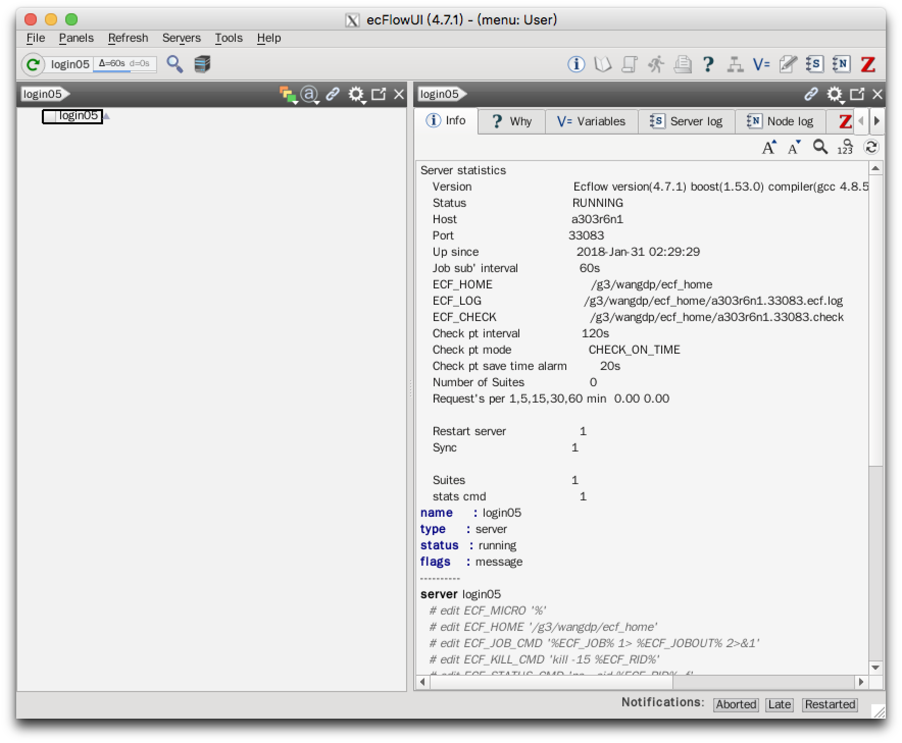
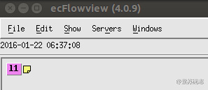

# 开始使用

本节介绍如何使用 ecFlow，并假设操作系统中已经安装过 ecFlow。

为了使用 ecFlow，需要启动 ecflow server。首先准备教程需要的目录，在 `$WORKDIR` 目录下创建 `ecf_home` 目录，并切换进该目录。

```
$cd $WORKDIR
$mkdir -p ecf_home
$cd ecf_home
```

## 共享环境

共享环境中多个用户和多个 ecFlow 服务器可以同时存在，通过使用启动脚本 `ecflow_start.sh` 实现。
该脚本会使用由用户 ID 唯一确定的端口号在你的系统中启动 `ecflow_server` 服务进程。
脚本默认在 `$HOME/ecflow_server` 目录中创建 ecFlow 的日志和 [check point](https://software.ecmwf.int/wiki/display/ECFLOW/Glossary#term-check-point) 文件。
可以使用 -d 选项改变日志和归档点文件的位置，例如将这些文件放到课程目录里：

```bash
ecflow_start.sh -d $WORKDIR/ecf_home -p 33083
```

启动 ecflow 服务：

```
$ecflow_start.sh -d $WORKDIR/ecf_home -p 33083
[02:29:28 31.1.2018] Request( --ping :wangdp ), Failed to connect to a303r6n1:33083. After 2 attempts. Is the server running ?

a303r6n1 a303r6n1 33083
Wed Jan 31 02:29:28 UTC 2018

User "1021308" attempting to start ecf server on "a303r6n1" using ECF_PORT "33083" and with:
ECF_HOME     : "/g3/wangdp/ecf_home"
ECF_LOG      : "a303r6n1.33083.ecf.log"
ECF_CHECK    : "a303r6n1.33083.check"
ECF_CHECKOLD : "a303r6n1.33083.check.b"
ECF_OUT      : "/dev/null"

client version is Ecflow version(4.7.1) boost(1.53.0) compiler(gcc 4.8.5) protocol(TEXT_ARCHIVE) Compiled on Jan 18 2018 01:15:48
Checking if the server is already running on a303r6n1 and port 33083
[02:29:29 31.1.2018] Request( --ping :wangdp ), Failed to connect to a303r6n1:33083. After 2 attempts. Is the server running ?


Backing up check point and log files

OK starting ecFlow server...

Placing server into RESTART mode...

To view server on ecflow_ui - goto Servers/Manage Servers... and enter
Name        : <unique ecFlow server name>
Host        : a303r6n1
Port Number : 33083
```

运行之后可以查看后台进程:

```
$ps -u wangdp -f | grep ecflow | grep -v grep
wangdp    73681      1  0 02:29 pts/17   00:00:00 ecflow_server
```
从 ecflow_ui 中查看启动的服务器



## 本地环境

环境变量：`ECF_PORT` `ECF_NODE` `ECF_HOME`

推荐使用 `ecflow_start.sh` 脚本启动 ecFlow 服务器，来避免不需要的服务器共享使用。
可以用默认的 `ECF_PORT`，在 UNIX 提示符下输入下面的命令在本地机器中启动服务器

```bash
ecflow_server
```

将会在系统中以默认的名字 `localhost` 和默认的端口号 `3141` 启动 `ecflow_server`。

## 前台运行

> 本节由译者添加

如果机器中的另一个程序占用这个端口号，就会得到一个 Address in use 错误。使用如下的命令在指定的端口号上运行服务：

```
ecflow_server --port=3500
```

或者

```
export ECF_PORT=3500; ecflow_server
```

此时如果想在 ecflowview 中查看服务，需要修改 `.ecflowrc/servers` 文件（默认位置），添加类似如下一行：

```
server1 localhost 3500
```

> 如果第一个名字与 `/usr/local/share/ecflow/servers` 中的相同，就会被后者覆盖，所以不能命名为 localhost，因为后者文件中有 localhost 一行。

这样就能在 ecflowview 中查看新运行的服务器了。



`ecflow_server` 的日志文件和 check point 文件默认将在当前文件夹中创建，并且以

```
<machine_name>.<port_number>
```

开头。这样多个服务可以运行在同一台机器上。
如果之前已经运行过一样的 `ecflow_server`，服务将尝试从 check point 文件中恢复 suite definition。例如

```text
$ ls
ubuntu.3141.ecf.check ubuntu.3141.ecf.log ubuntu.3500.ecf.log
```

运行过两个 `ecflow_server`，其中 3500 没有启动过，所以没有 check point 文件。

## 任务

1. 参考之前的章节安装 ecflow
2. 创建 `$WORKDIR/ecf_home` 目录
3. 使用如下命令启动服务

    ```bash
    ecflow_start.sh -d $WORKDIR/ecf_home
    ```

4. 注意 `ECF_NODE` 和 `ECF_PORT` 变量
5. 注意：如果下面的章节中需要启动一个新的 shell 来访问服务，需要手动指定 host 和 port，如果已设置环境变量 `ECF_PORT` 和 `ECF_HOST`，则可以直接调用命令。
