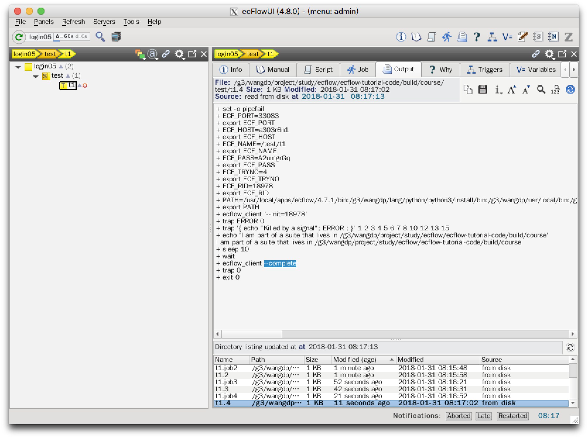
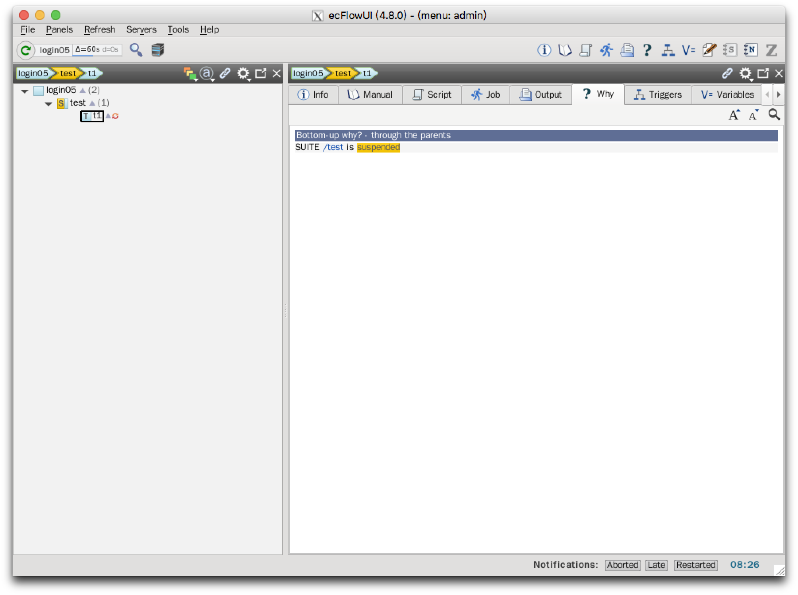
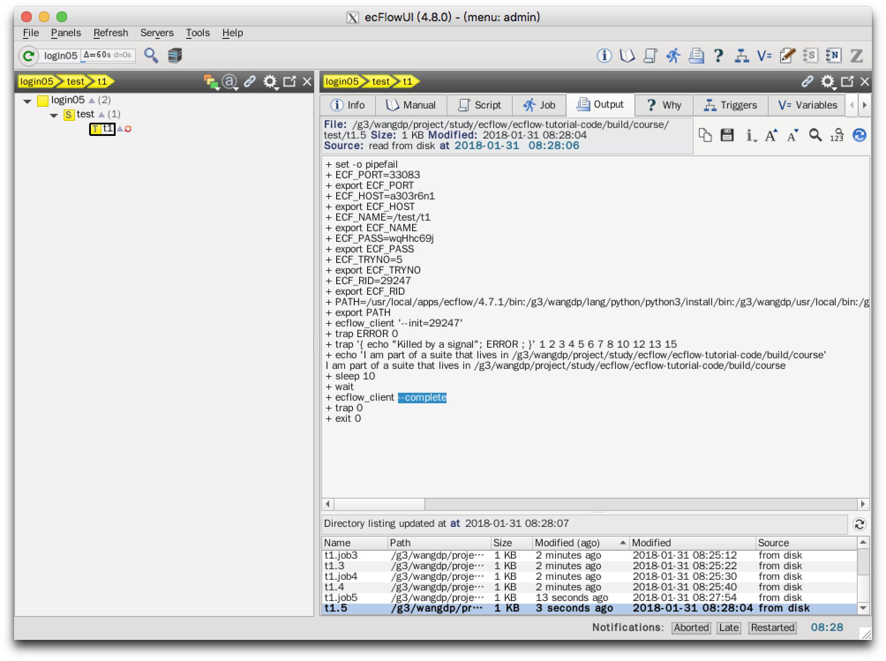

# 执行、重新执行、重新排队

在 `ecflow_ui` 中理解执行（execute）、重新执行（rerun）和重新排队（re-queue）的区别非常关键。

这些命令在右键点击 task 节点时可用。译者注：点击 family 节点可以用 requeue。

- Execute：立即执行任务。因此忽略阻止该节点运行任何依赖条件。

    该选项保留作业脚本之前的运行输出，应该看到 `t1.1`、`t1.2`、`t1.3` 等输出文件，每次执行任务都会生成一个新的文件。

- Rerun：将任务回退到 queued 状态。

    任务将会遵从任何阻止作业运行的依赖条件，例如 time dependencies, limits, triggers, suspend 等等（后面将会介绍这些概念）。如果任务确实执行了，会保留之前的输出结果。

- Re-queue：将任务重置到 queued 状态。

    如果任务有默认的状态，则应用该状态。任务输出文件的序号被重置，因此下一个输出将被写入到 `t1.t` 文件中。

    任务运行时，将**覆盖**任何已经存在的输出文件。

    后续的 `execute` 或 `rerun` 将覆盖对应序号的输出文件，如 `t1.2`、`t1.3`。

## 任务

1. 挂起 suite。选择 `test` 节点，右键点击选择 `suspend` 命令。

2. 选择 task t1，从右键菜单中选择 `execute`。

    尽管父节点被挂起，任务依然会执行。重复操作多次，可以看到每次运行的输出结果都被保留。
    点击信息面板的 output 标签查看输出文件。

    

3. 选择 task t1，从右键菜单中选择 `rerun`。

    节点被退回到 re-queue 状态。但因为我们已经挂起父节点，所以 t1 不会运行。

    

    使用右键菜单的 resume 命令，恢复父节点 `test`，task t1 会运行，注意原来的输出文件被保留。

    

4. 重新挂起 test 节点。

5. 选择 task t1 节点，右键菜单选择 requeue 命令。

    节点进入 queued 状态。父节点被挂起，阻止该任务运行。恢复父节点，task t1 才会运行。
    此次运行会覆盖之前的输出文件 `t1.1`。

    
