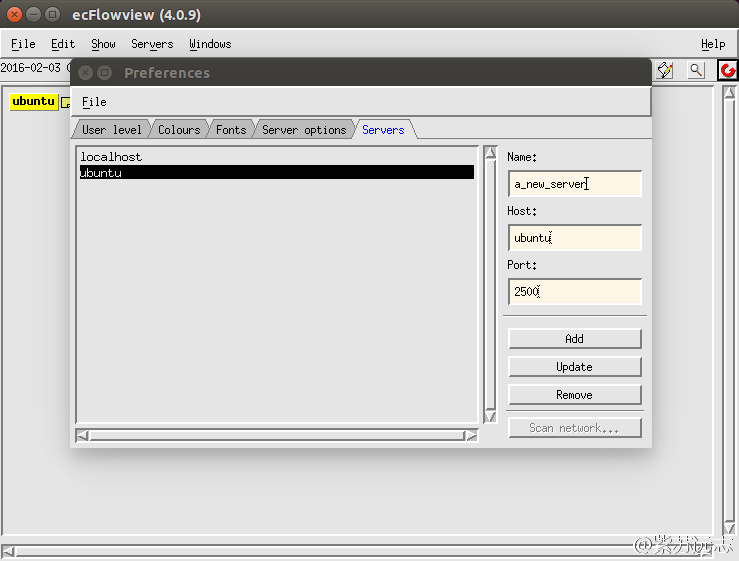
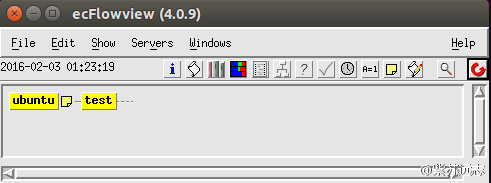
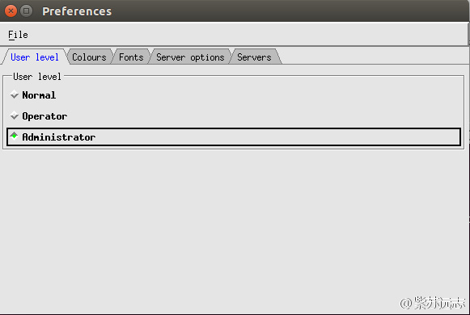
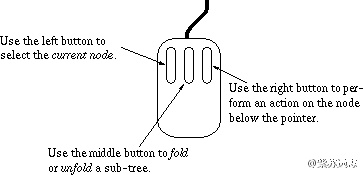

# 使用ecFlowview

> 译者注：ecFlow 已开发基于 Qt 的新版 GUI —— ecflow_ui，功能更强大。

我们看下 ecFlow 的 旧版 GUI —— ecFlowview，命令行下输入 `ecflowview`。

程序运行后：

- 从 Edit 菜单中选择 Preference
- 接下来点击 Servers 标签，输入 ecflow 服务器的详细信息。为 ecflow 服务器取个名字，添加 Host 和 Port，点击添加按钮。

可以从 ecflowview 的主菜单的 Server 菜单中选择 ecflow_server。会在主窗体中显示服务器信息：

黄色的盒子叫做 node。在 test 上点击鼠标中键

现在可以查看 ecf script，job file 和 task t1 的输出文件。点击t1，然后点击 script 图标，会弹出一个窗口显示任务脚本：

点击不同的标签查看 ECF job 文件或者输出文件。如果想要在不同的窗口查看输出文件，点击 output 图标。

如果想要重新运行 suite，鼠标右键点击 test，在弹出菜单中选择 requeue

如果没有出现 requeue 选项，在 Edit 菜单中选择 Preferences…，并将用户等级提升至 Administrator

注意 node 颜色的变化，颜色的变化反应 node 的 status。

ecFlowview 使用鼠标的三个按钮实现不同的操作。下面的图显示 ecFlowview 中如何使用鼠标按钮：

## 任务

1. 探索 ecFlowview 的菜单和窗口
2. 作业状态变化与 ecflowview 窗口中展现这些变化有一段较长的延时。想要更快地更新到当前状态，请点击红色状态按钮。
