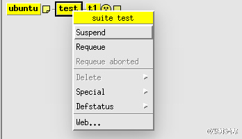

# 添加另一个任务

我们来添加一个新任务名为t2，需要修改 suite definition 文件并添加一个新的脚本。

在 $HOME/course/test 中创建文件 t2.ecf，直接复制 t1.ecf 即可。

首先修改 suite definition

## 文本方式

在重新加载 suite 的任何部分前推荐先将 suite 挂起（suspend）。在 ecflowview 中右键点击suite，选择 Suspend。当修改完成后，右键点击 suite，选择 Resume。



挂起后，suite 颜色会改变


恢复 suite


添加新任务t2的 def 文件

```bash
# Definition of the suite test
suite test
   edit ECF_HOME "$HOME/course"  # replace '$HOME' with the path to your home directory
   task t1
   task t2
endsuite
```

译者注：与之前一样，使用实际的home目录替换 $HOME

在 test 目录下，复制 t1.ecf，创建 task t2 的脚本 t2.ecf。

重新加载 def 文件

```bash
ecflow_client --load=test.def
```

已经加载过 def 文件时，上述命令不会成功。

```bash
windroc@ubuntu:~/course$ ecflow_client --load=test.def
Error: request( --load=test.def  :windroc ) failed!  Server replied with: 'Add Suite failed: A Suite of name 'test' already exist'
```

需要删除原有的suite，并重新加载：

```bash
ecflow_client --delete=_all_
ecflow_client --load=test.def
```

接着启动 suite

```bash
ecflow_client --begin=test
```

可以不用删除原来的 suite，替换整个 suite 定义：

```bash
ecflow_client --replace=/test test.def
```

可以只替换 suite 的一部分：

```bash
ecflow_client --replace=/test/t2 test.def
```

替换一部分后的状态


这时可以恢复 suite。

## Python方式

使用 Client Server API 删除 suite definition，重载和启动suite：首先更新 test.py

重新生成 def 文件：

```python
#!/usr/bin/env python2.7
import os
import ecflow

print "Creating suite definition"   
defs = ecflow.Defs()
suite = defs.add_suite("test")
suite.add_variable("ECF_HOME", os.path.join(os.getenv("HOME"),  "course"))
suite.add_task("t1")
suite.add_task("t2")
print defs

print "Checking job creation: .ecf -> .job0"   
print defs.check_job_creation()

print "Saving definition to file 'test.def'"
defs.save_as_defs("test.def")
```

删除所有的 suite，重新加载修改后的 def文件，需要修改 client.py：

```python
#!/usr/bin/env python2.7
import ecflow 
   
print "Client -> Server: delete, then load a new definition"   
try:
    ci = ecflow.Client()
    ci.delete_all()           # clear out the server
    ci.load("test.def")       # load the definition into the server
    ci.begin_suite("test")    # start the suite
except RuntimeError as e:
    print "Failed:",   e
```


我们还可以替换全部或部分 suite。

另外，我们不希望 suite 立即运行，可以通过 ecflowview 挂起整个 suite，不过我们每次都需要记得这样做。
为了方便，可以使用 Python Client API 挂起 suite。修改上面的 client.py

```python
#!/usr/bin/env python2.7
import ecflow 
   
print "Client -> Server: replacing suite '/test' in the server, with a new definition"   
try:
    ci = ecflow.Client()
    ci.suspend("/test")              # so that we can resume manually in ecflowview
    ci.replace("/test", "test.def")
except RuntimeError as e:
    print "Failed:",   e
```

说明：为了简便，后面的例子我们都不会列出加载 suite 的过程。

## 任务


1. 使用 ecflowview 或 pyhton 的 ecflow.Client.suspend 挂起 suite
2. 创建新的 task
3. 通过拷贝 t1.ecf 创建 t2.ecf
4. 更新python脚本 test.py 和 client.py 或 test.def
5. 替换 suite
6. 使用 ecflowview 恢复 suite
7. 在 ecflowview 中观察两个任务运行情况，它们应该在同一时刻运行。
