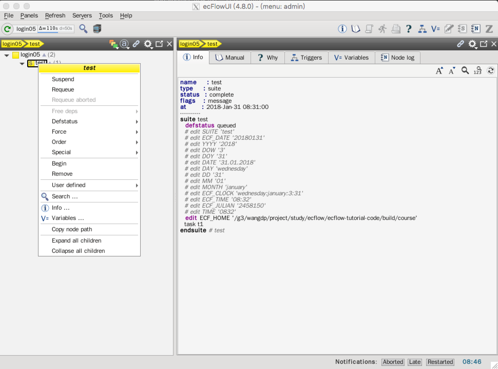
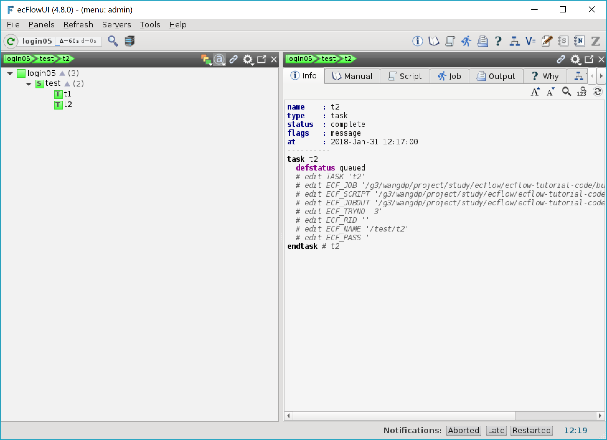

# 添加另一个任务

我们来添加一个新任务 `t2`，需要修改 suite definition 文件并添加一个新的脚本。

在 `$ECF_HOEM/course/test` 中创建文件 `t2.ecf`，直接复制 `t1.ecf` 即可。

首先修改 suite definition。

## 文本方式

在重新加载 suite 的任何部分前推荐先将 suite 挂起（suspend）。在 ecflow_ui 中右键点击 suite，选择 Suspend。当修改完成后，右键点击 suite，选择 Resume。



挂起后，suite 颜色会改变


恢复 suite


添加新任务 `t2` 的 def 文件

```bash
# Definition of the suite test
suite test
   edit ECF_HOME "$ECF_HOME/course"
   task t1
   task t2
endsuite
```

> 译者注：与之前一样，需要设置环境变量 `$ECF_HOME`

在 `test` 目录下，复制 `t1.ecf`，创建 task t2 的脚本 `t2.ecf`。

重新加载 def 文件

```
ecflow_client --load=test.def
```

如果已经加载过 def 文件，上述命令不会成功。

```
$ecflow_client --host=login05 --port=33083 --load=../../../build/course/test.def
Error: request( --load=../../../build/course/test.def  :wangdp ) failed!  Server replied with: 'Add Suite failed: A Suite of name 'test' already exist'

make: *** [load] Error 1

```

需要删除原有的suite，并重新加载：

```
ecflow_client --host=login05 --port=33083 --delete=_all_
ecflow_client --host=login05 --port=33083 --load=test.def
```

接着启动 suite

```
ecflow_client --host=login05 --port=33083 --begin=test
```

可以不用删除原来的 suite，替换整个 suite 定义：

```
ecflow_client --host=login05 --port=33083 --replace=/test test.def
```

可以只替换 suite 的一部分：

```
ecflow_client --host=login05 --port=33083 --replace=/test/t2 test.def
```

替换一部分后的状态



这时可以恢复 suite。

## Python方式

使用 Client Server API 删除 suite definition，重载和启动 suite。

首先更新 `test.py`，重新生成 def 文件：

```py
import os
from pathlib import Path
from ecflow import Defs, Suite, Task, Edit

print("Creating suite definition")
home = os.path.abspath(Path(Path(__file__).parent, "../../../build/course"))
defs = Defs(
    Suite(
        'test',
        Edit(ECF_HOME=home),
        Task('t1'),
        Task('t2')
    )
)
print(defs)

print("Checking job creation: .ecf -> .job0")
print(defs.check_job_creation())

print("Saving definition to file 'test.def'")
defs.save_as_defs(str(Path(home, "test.def")))

```

删除所有的 suite，重新加载修改后的 def文件，需要修改 client.py：

```py
import os
from pathlib import Path
import ecflow

home = os.path.abspath(Path(Path(__file__).parent, "../../../build/course"))
try:
    print("Loading definition in 'test.def' into the server")
    ci = ecflow.Client('login05', '33083')
    ci.delete("/test")
    ci.load(str(Path(home, "test.def")))
    ci.begin_suite("test")
except RuntimeError as e:
    print("Failed:", e)
```


我们还可以替换全部或部分 suite。

另外，我们不希望 suite 立即运行，可以通过 ecflowview 挂起整个 suite，不过我们每次都需要记得这样做。
为了方便，可以使用 Python Client API 挂起 suite。修改上面的 client.py

```py
import os
from pathlib import Path
import ecflow

home = os.path.abspath(Path(Path(__file__).parent, "../../../build/course"))
try:
    print("Loading definition in 'test.def' into the server")
    ci = ecflow.Client('login05', '33083')
    ci.suspend("/test")
    ci.replace("/test", str(Path(home, "test.def")))
except RuntimeError as e:
    print("Failed:", e)
```

说明：为了简便，后面的例子我们都不会列出加载 suite 的过程。

## 任务


1. 使用 ecflow_ui 或 pyhton 的 `ecflow.Client.suspend` 挂起 suite
2. 创建新的 task
3. 通过拷贝 `t1.ecf` 创建 `t2.ecf`
4. 更新 python 脚本 `test.py` 和 `client.py` 或 `test.def`
5. 替换 suite

    python:
    
    ```
    python test.py
    python client.py
    ```

    文本：

    ```
    ecflow_clinet --replace=/test test.def
    ```

6. 使用 ecflow_ui 恢复 suite
7. 在 ecflow_ui 中观察两个任务运行情况，它们应该在同一时刻运行。
