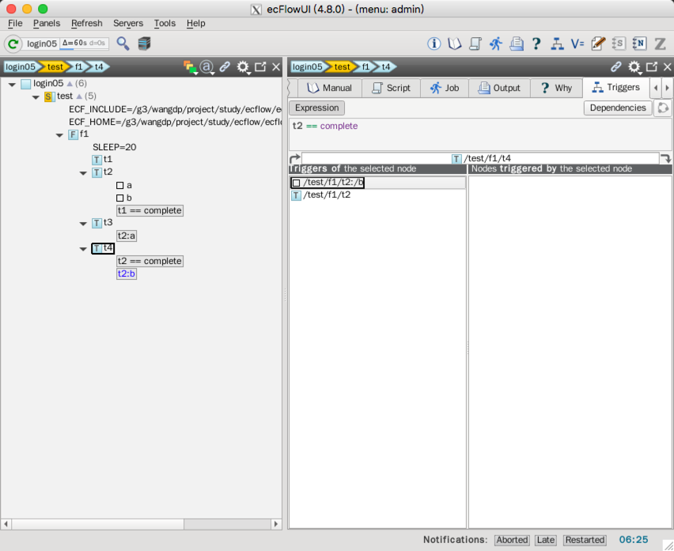
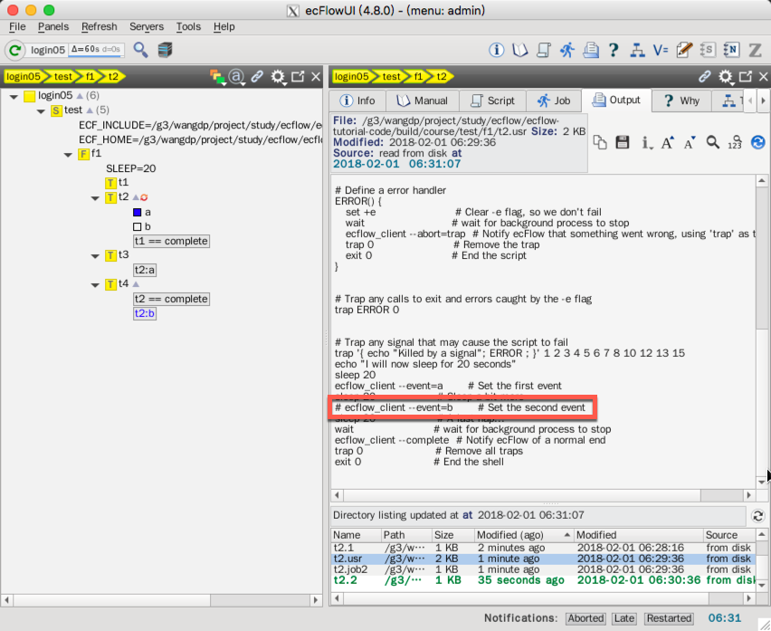

# 添加complete

有时希望在满足某条件时不运行某任务，条件可以用 event 标识。
例如， event t2:b 可能暗示 task t2 没有生成期待的结果，所以我们不需要运行 task t4.

这种情况下，可以使用 complete 表达式（[complete expression](https://software.ecmwf.int/wiki/display/ECFLOW/Glossary#term-complete-expression)），
与关键词 [trigger](https://software.ecmwf.int/wiki/display/ECFLOW/Glossary#term-trigger) 有类似的语法，
但在满足条件时将任务置为 [complete](https://software.ecmwf.int/wiki/display/ECFLOW/Glossary#term-complete) 状态而不运行该任务。

当 [ecflow_server](https://software.ecmwf.int/wiki/display/ECFLOW/Glossary#term-ecflow-server) 尝试启动一个 [task](https://software.ecmwf.int/wiki/display/ECFLOW/Glossary#term-task) 时，
会检查 trigger 和 complete 表达式。如果满足 complete 表达式，任务就会被设为 complete 状态。
检查时，complete 表达式优先于 trigger 表达式。

complete 可以用于 [task](https://software.ecmwf.int/wiki/display/ECFLOW/Glossary#term-task) 间、family 间或者两者混合，也可以与 trigger 联合使用。

## Suite Definition

在 suite definition 中定义 complete。

### Text

```bash
# Definition of the suite test.
suite test
   edit ECF_INCLUDE "$ECF_HOME"   # replace '$ECF_HOME' with the path to your ECF_HOME directory
   edit ECF_HOME    "$ECF_HOME"
   family f1
     edit SLEEP 20
     task t1
     task t2
         trigger t1 eq complete   # task t2 will only start when task t1 is complete
         event a                  # task t2 will set an event a
         event b                  # task t2 will set an event b
     task t3
         trigger t2:a             # task t3 will start when event a is set in task t2
     task t4
         trigger t2 eq complete   # task t4 will start when task t2 is complete
         complete t2:b            # task t4 will complete if event b is set in task t2
   endfamily
endsuite
```

### Python

```py
import os
from pathlib import Path
from ecflow import Defs, Suite, Task, Family, Edit, Trigger, Event, Complete


def create_family_f1():
    return Family(
        "f1",
        Edit(SLEEP=20),
        Task("t1"),
        Task(
            "t2",
            Trigger("t1 == complete"),
            Event('a'),
            Event('b')),
        Task(
            "t3",
            Trigger("t2:a")),
        Task(
            "t4",
            Trigger("t2 == complete"),
            Complete("t2:b"))
    )


print("Creating suite definition")
home = os.path.abspath(Path(Path(__file__).parent, "../../../build/course"))
defs = Defs(
    Suite('test',
          Edit(ECF_INCLUDE=home, ECF_HOME=home),
          create_family_f1()))
print(defs)

print("Checking job creation: .ecf -> .job0")
print(defs.check_job_creation())

print("Saving definition to file 'test.def'")
defs.save_as_defs(str(Path(home, "test.def")))

# To restore the definition from file 'test.def' we can use:
# restored_defs = ecflow.Defs("test.def")

```

运行脚本：

```
$python test.py
Creating suite definition
# 4.8.0
suite test
  edit ECF_INCLUDE '/g3/wangdp/project/study/ecflow/ecflow-tutorial-code/build/course'
  edit ECF_HOME '/g3/wangdp/project/study/ecflow/ecflow-tutorial-code/build/course'
  family f1
    edit SLEEP '20'
    task t1
    task t2
      trigger t1 == complete
      event a
      event b
    task t3
      trigger t2:a
    task t4
      complete t2:b
      trigger t2 == complete
  endfamily
endsuite

Checking job creation: .ecf -> .job0

Saving definition to file 'test.def'
```



## 任务


1. 更新 `test.def` 或 `test.py`，为 t4 添加 complete 表达式
2. 替换 [suite](https://software.ecmwf.int/wiki/display/ECFLOW/Glossary#term-suite)
3. 查看 ecflow_ui
4. 查看 t4 的触发器
5. 注意表示 task 未运行的图标


6. 可以修改 task t2，检查事件未激活时 task t4 是否运行。注释 t2 脚本中 event b 的语句。


