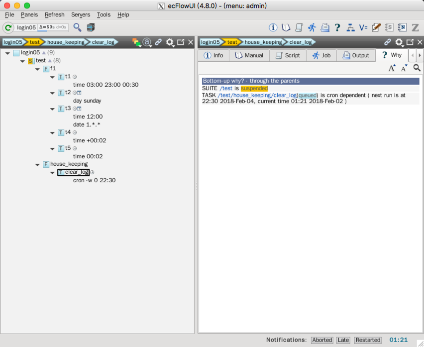

# 添加 Cron

`ecflow_server` 会在一个日志文件中记录所有发送给它的命令，默认文件名为 `<host>.<port>.ecf.log`。

该日志文件的大小会随着时间显著增长。

在这个练习中我们将创建一个任务，用于定期备份并清理该日志文件。

将使用上一章节介绍的 `cron` 属性。定义 `cron` 属性的任务会无限运行，也就是一旦任务完成，将会自动重新排队自己。

关于添加 `cron` 的更多示例请参阅[用户文档](https://software.ecmwf.int/wiki/display/ECFLOW/Adding+Time+Dependencies)。

## Ecf 脚本

我们先创建一个新的脚本，`clear.ecf`。

```bash
%include <head.h>
 
# copy the log file to the ECF_HOME/log directory
cp %ECF_LOG% %ECF_HOME%/log/.
  
# clear the log file
ecflow_client  --log=clear
 
%include <tail.h>
```

## Suite 定义

### 文本方式

为了简便，省略前面的节点定义。

```bash
# Definition of the suite test.
suite test
 edit ECF_INCLUDE "$ECF_HOME"    # replace '$ECF_HOME' with the path to your ECF_HOME directory
 edit ECF_HOME    "$ECF_HOME"
 family house_keeping
     task clear_log
       cron -w 0 22:30  # run every Sunday at 10:30pm
 endfamily
endsuite
```

### Python


```py
import os
from pathlib import Path
from ecflow import Defs, Suite, Task, Family, Edit, Trigger, \
    Event, Complete, Meter, Time, Day, Date, Cron


def create_family_f1():
    return Family(
        "f1",
        Edit(SLEEP=20),
        Task("t1",
             Time("03:00 23:00 00:30")),
        Task("t2",
             Day("sunday")),
        Task("t3",
             Date("1.*.*"),
             Time("12:00")
             ),
        Task("t4",
             Time("+00:02")),
        Task("t5",
             Time("00:02"))
    )


def create_family_house_keeping():
    return Family("house_keeping",
                  Task("clear_log",
                       Cron("22:30", days_of_week=[0])))


print("Creating suite definition")
home = os.path.abspath(Path(Path(__file__).parent, "../../../build/course"))
defs = Defs(
    Suite('test',
          Edit(ECF_INCLUDE=home, ECF_HOME=home),
          create_family_f1(),
          create_family_house_keeping()))
print(defs)

print("Checking job creation: .ecf -> .job0")
print(defs.check_job_creation())

print("Saving definition to file 'test.def'")
defs.save_as_defs(str(Path(home, "test.def")))

# To restore the definition from file 'test.def' we can use:
# restored_defs = ecflow.Defs("test.def")
```

运行脚本

```
$python test.py
Creating suite definition
# 4.8.0
suite test
  edit ECF_INCLUDE '/g3/wangdp/project/study/ecflow/ecflow-tutorial-code/build/course'
  edit ECF_HOME '/g3/wangdp/project/study/ecflow/ecflow-tutorial-code/build/course'
  family f1
    edit SLEEP '20'
    task t1
      time 03:00 23:00 00:30
    task t2
      day sunday
    task t3
      time 12:00
      date 1.*.*
    task t4
      time +00:02
    task t5
      time 00:02
  endfamily
  family house_keeping
    task clear_log
      cron -w 0 22:30
  endfamily
endsuite

Checking job creation: .ecf -> .job0

Saving definition to file 'test.def'
```

## 任务

1. 修改 suite definition 文件
2. 创建所有需要的 ecf 脚本文件。
3. 替换 suite。
4. ecflow_ui 有专门的窗口解释任务为何处于排队状态。选择排队的任务，点击问号图标按钮或点击 Why 标签。



5. 手动运行任务，查看磁盘上的日志文件。

日志文件被清空：

```
MSG:[01:26:04 2.2.2018] chd:complete /test/house_keeping/clear_log
LOG:[01:26:04 2.2.2018]  complete: /test/house_keeping/clear_log
LOG:[01:26:04 2.2.2018]  queued: /test/house_keeping/clear_log
LOG:[01:26:04 2.2.2018]  queued: /test/house_keeping
LOG:[01:26:04 2.2.2018]  queued: /test
LOG:[01:26:04 2.2.2018]  queued: /
MSG:[01:26:07 2.2.2018] --news=0 187 16  :wangdp [server(202,16) : *Small* scale changes :NEWS]
MSG:[01:26:07 2.2.2018] --sync=0 187 16  :wangdp
MSG:[01:26:09 2.2.2018] --news=0 202 16  :wangdp [:NO_NEWS]
MSG:[01:26:26 2.2.2018] svr:check_pt in 0 seconds
```

