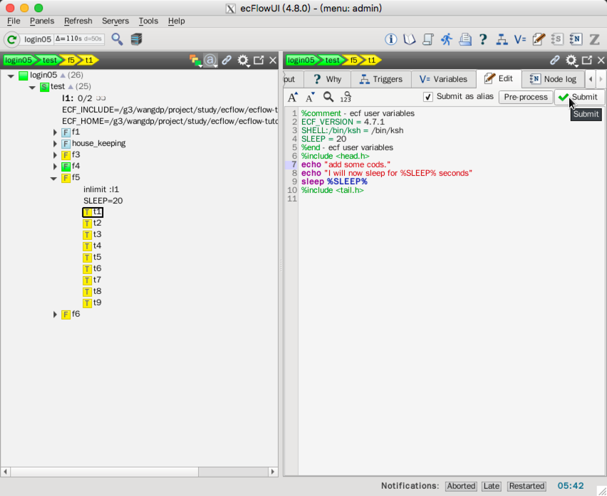
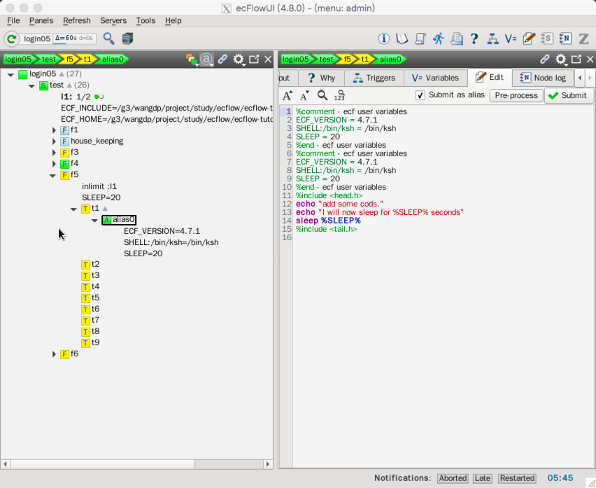
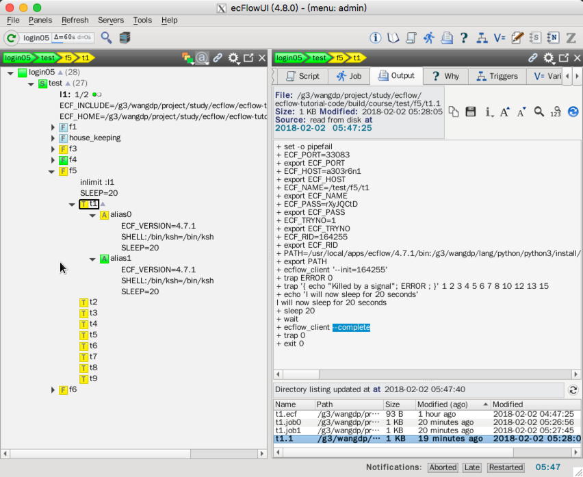
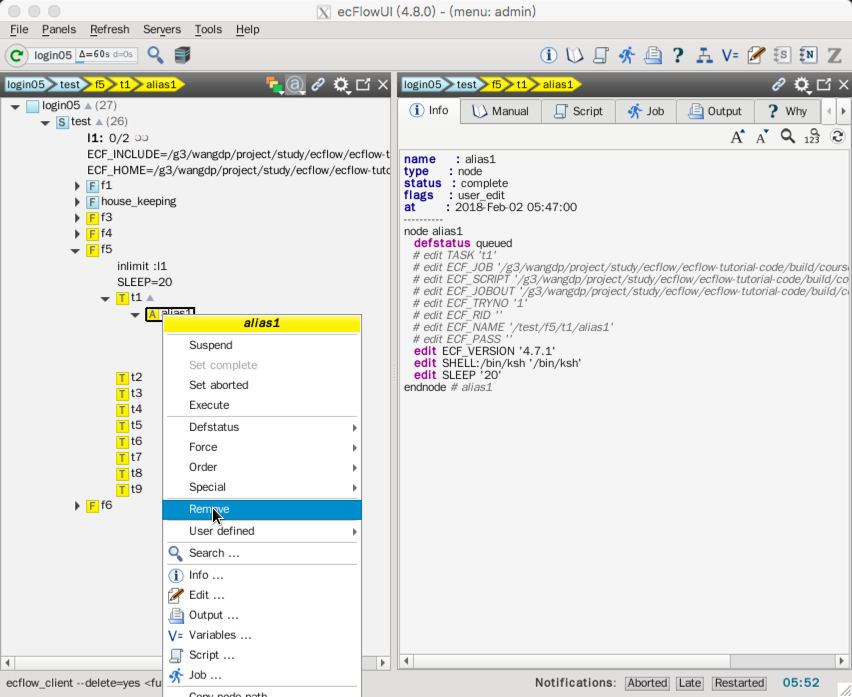

# Alias

一个对**编辑**非常有用的扩展就是复制一个 task，对脚本进行微小的修改，并作为一个 "alias" 运行，对于调试脚本非常有用。

这样的任务可以在 ecFlow 的控制下运行，但不会对 suite 本身的运行产生任何影响，例如 alias 没有依赖关系。

Alias 可以用与运行之前某个日期的任务，或者解决诸如磁盘空间满等临时问题。

这种情况下，任务可以在另一块硬盘中运行，以保证 suite 按时完成。

分析师就会有时间查找问题出现的原因并采取必要的措施。

## 任务

1. 选择一个已经存在的任务，在 info 面板中选择 Edit 标签。

2. 修改脚本，例如添加 `sleep 1` 之类的语句。

3. 选择 'Submit as alias'，然后提交作业。

    

    注意到一个新节点（alias）被添加为 task 的子节点。

    

4. 选择同一个任务，重复上述过程。这将表明一个 task 可以有多个 alias。并且每个 alias 编辑过的脚本均被保留。

    

5. 选择一个 alias，强制设为 aborted 状态。右键选择 Force -> Aborted。注意 alias 节点的状态没有传递给父节点。

    

6. 最后在树视图中选择 alias，右键点击，选择 Remove，alias 节点将从树中移除。

    
