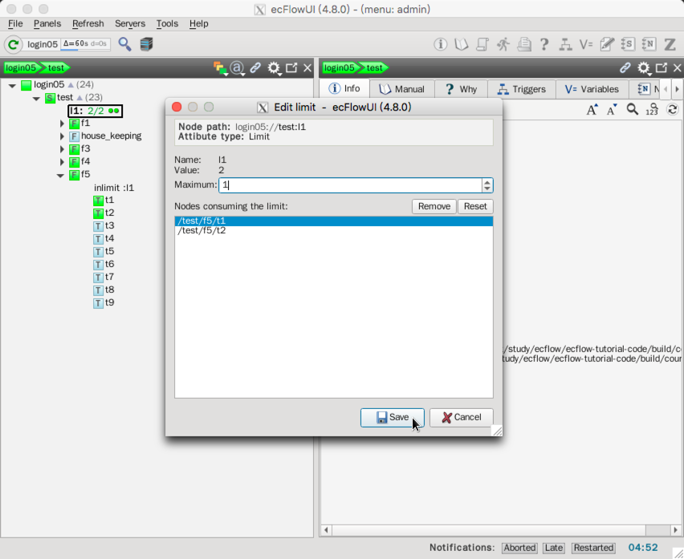
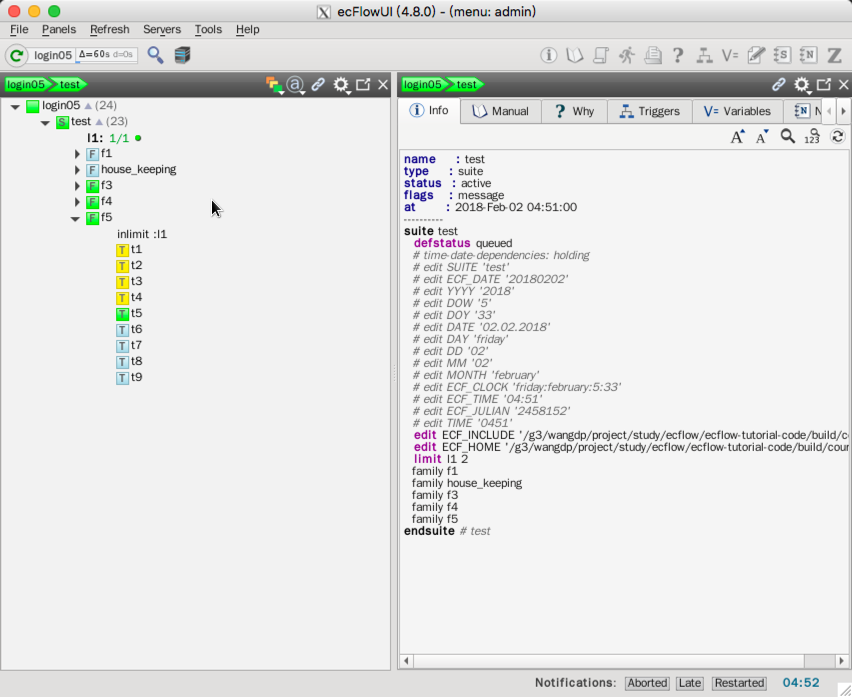

# Limit

limits 提供简单的负载管理，限制提交到某个 `ecflow_server` 上的作业数目。

suite 设计者使用两种触发器：

* data dependency trigger：由 `trigger` 关键词设置
* courtesy trigger：由 [limit](https://software.ecmwf.int/wiki/display/ECFLOW/Glossary#term-limit) 关键词设置

trigger 是第一种触发器。第二种用于防止同时运行过多的作业，实际上是一种人工的作业排队方法。
因为 ecflow 不区分这两种触发器，不利于后续维护。所以引入 limit。

## inlimit

limits 与 [inlimit](https://software.ecmwf.int/wiki/display/ECFLOW/Glossary#term-inlimit) 同时使用。

首先定义 limit： `limit NAME N`，通常放在 suite 级

接着将定义一组想应用该 limit 的 task，将 `inlimit NAME` 属性添加到节点。添加到 task 中将该 task 加入到 limit 组；添加到 family 将该 family 下的所有任务添加到 limit 组。

limit 的效果是确保该组中同时运行的任务数不超过 N。一个节点可以被多个 limit 限制。

## Ecf脚本

创建有九个 task 的 family f5。

在 `$ECF_HOME/test/f5/` 目录下创建这些 ecf script 脚本，每个内容如下：

```bash
%include <head.h>
echo "I will now sleep for %SLEEP% seconds"
sleep %SLEEP%
%include <tail.h>
```

## suite definition

在 suite definition 中添加 limit。

### Text

```bash
# Definition of the suite test.
suite test
 edit ECF_INCLUDE "$ECF_HOME"
 edit ECF_HOME    "$ECF_HOME"
 limit l1 2
 
 family f5
     inlimit l1
     edit SLEEP 20
     task t1
     task t2
     task t3
     task t4
     task t5
     task t6
     task t7
     task t8
     task t9
 endfamily
endsuite
```

#### 定义语法

```bash
limit  ::=  "limit" >> ( identifier >> unsigned int ) >> +nextline
inlimit  ::=  "inlimit" >>( (nodePath >> ":“ >> identifier) | identifier )) >> ! unsigned int >> +nextline
```

### Python

```py
import os
from pathlib import Path
from ecflow import Defs, Suite, Task, Family, Edit, Trigger, \
    Event, Complete, Meter, Time, Day, Date, Cron, Label, \
    RepeatString, RepeatInteger, RepeatDate, Limit, InLimit


# ... skip ...

def create_family_f5():
    return Family("f5",
                  InLimit("l1"),
                  Edit(SLEEP=20),
                  [Task('t{}'.format(i)) for i in range(1, 10)])


print("Creating suite definition")
home = os.path.abspath(Path(Path(__file__).parent, "../../../build/course"))
defs = Defs(
    Suite('test',
          Edit(ECF_INCLUDE=home, ECF_HOME=home),
          Limit("l1", 2),
          create_family_f1(),
          create_family_house_keeping(),
          create_family_f3(),
          create_family_f4(),
          create_family_f5()))
print(defs)

print("Checking job creation: .ecf -> .job0")
print(defs.check_job_creation())

print("Saving definition to file 'test.def'")
defs.save_as_defs(str(Path(home, "test.def")))

# To restore the definition from file 'test.def' we can use:
# restored_defs = ecflow.Defs("test.def")
```

运行结果：

```
python test.py
Creating suite definition
# 4.8.0
suite test
  edit ECF_INCLUDE '/g3/wangdp/project/study/ecflow/ecflow-tutorial-code/build/course'
  edit ECF_HOME '/g3/wangdp/project/study/ecflow/ecflow-tutorial-code/build/course'
  limit l1 2
  # ... skip ...
  family f5
    edit SLEEP '20'
    inlimit l1
    task t1
    task t2
    task t3
    task t4
    task t5
    task t6
    task t7
    task t8
    task t9
  endfamily
endsuite

Checking job creation: .ecf -> .job0

Saving definition to file 'test.def'
```

## Python API

### ecflow.InLimit

创建

```bash
InLimit(name, optional, optional)
   string name           : The name of the referenced Limit
   string path : The path to the Limit, if this is left out, then Limit of 'name' must be specified
                           some where up the parent hierarchy
   int value   : The usage of the Limit. Each job submission will consume 'value' tokens
                           from the Limit. defaults to 1 if no value specified.
```

使用

```python
inlimit = InLimit("fast","/x/f", 2)
# ...
family.add_inlimit(inlimit)
```

### ecflow.Limit

创建

```bash
Limit(name,value)
   string name: the name of the limit
   int   value: The value of the limit
```

```python
limit = Limit("fast", 10)
# ...
suite.add_limit(limit)
```

## 任务

1. 修改
2. 替换 suite definition
3. 在 ecflow_ui 中观察 limit l1

    

4. 修改 limit 的值

    

5. 打开 /test/f5 下某个排队 task 的 Why 面板

    
