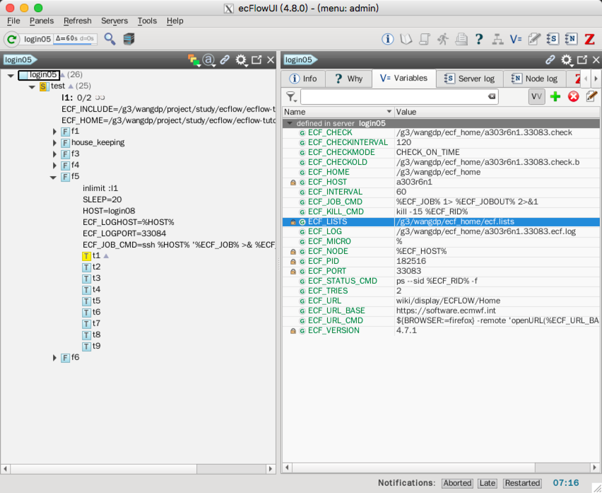

# 服务安全 —— 白名单文件

为控制其他用户对 `ecflow_server` 的访问权限，可以定义一个白名单文件，默认名 `<host>.<port>.ecf.lists`。

ECFLOW 白名单文件是一种限制已知用户访问权限的方法。

文件中列出具有全部权限的用户列表和只读权限的用户列表。

- 全部权限：单独的用户名，如 `user`
- 只读权限：以`-`开头后接用户名，如 `-user`

必须在第一个非注释行添加版本号，为了以后可能的格式扩展做准备，例如 `4.4.5`。

环境变量 `ECF_LISTS` 用于定义白名单文件的文件名，该文件应该保存在服务器的 `ECF_HOME` 文件夹中。

白名单文件是 ASCII 文件。

> 创建一个白名单文件时要确保为你的用户名添加读写权限，否则将无法控制自己的服务。

## 白名单文件示例

```bash
4.4.14 # whitelist version number
#Maintenance group and operators
#users with read/write access
myuid
uid1
uid2
#
#Read-only users
#
-uid3
-uid4
```

更多信息请查看 [ecFlow White list file](https://software.ecmwf.int/wiki/display/ECFLOW/ecFlow+White+list+file) 和 `ecflow_client --help reloadwsfile`。

## 任务

1. 期望的白名单文件名显示在 ecFLow 服务的 `ECF_LISTS` 变量中，请查看该变量。

    

2. 在 ecFlow 服务的根目录中创建以 `ECF_LISTS` 变量值为名的文件，将你的用户名加入其中。

3. 使用 client 命令加载白名单文件到服务中

```bash
ecflow_client --reloadwsfile
```
